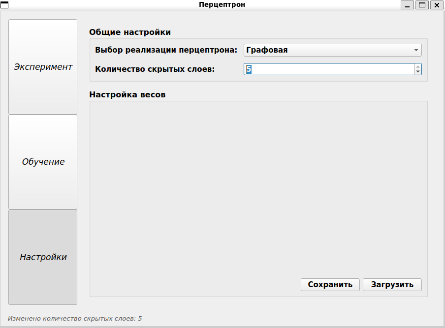
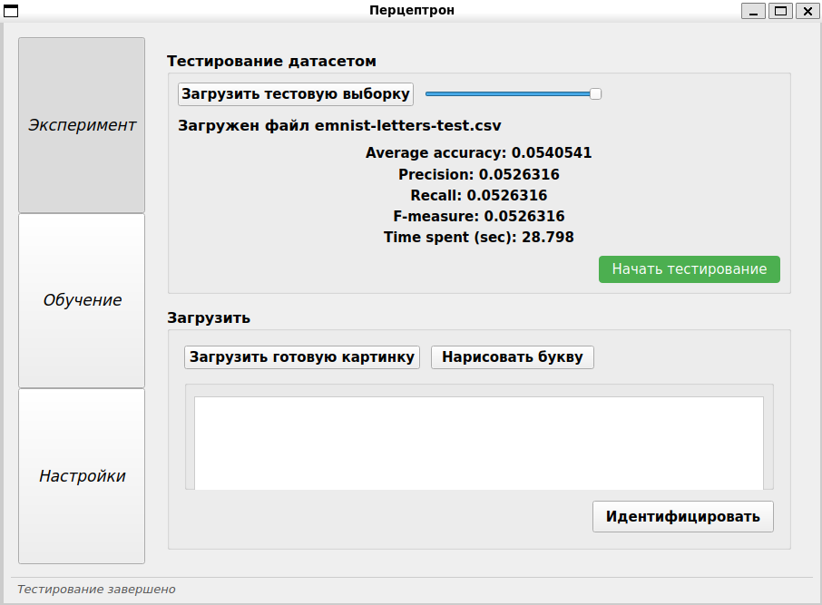
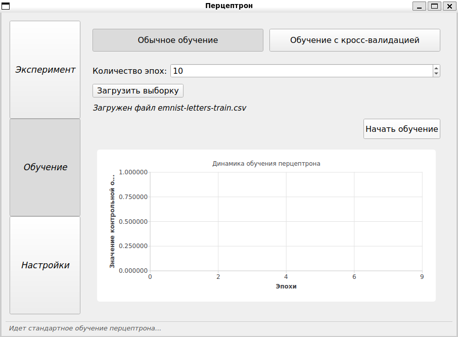
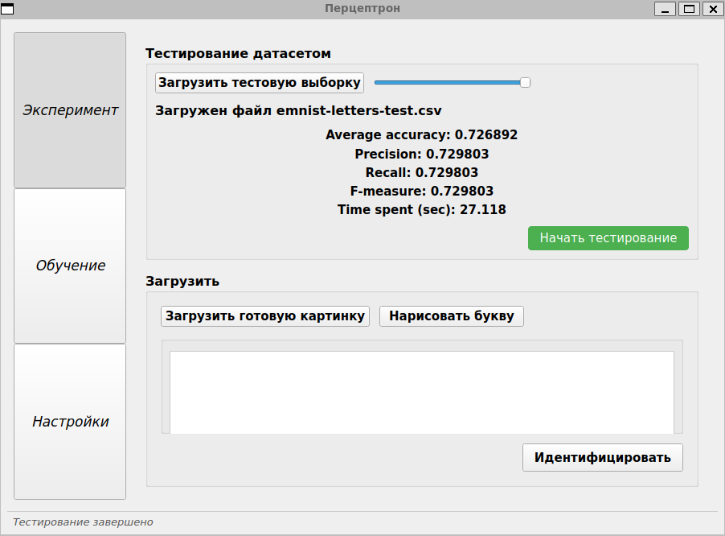
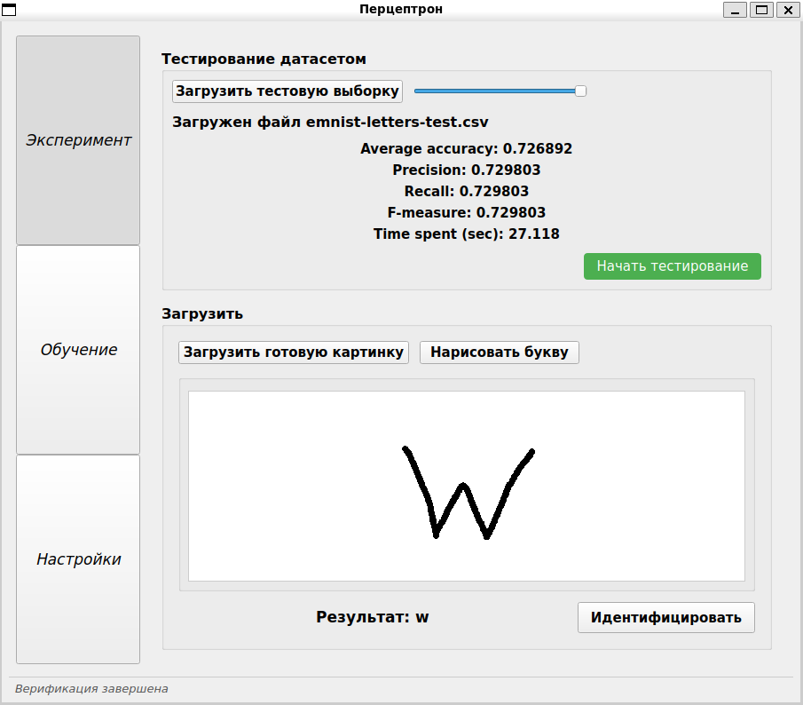

# Simple-Perceptron
Простейшая искусственная нейронная сеть в виде перцептрона, которая может быть обучена на открытом наборе данных и осуществляет распознавание 26 рукописных букв латинского алфавита

## Работа программы

Страница настроек перцептрона (выбрана графовая реализация с 5-ю скрытыми слоями)


Тестирование перцептрона до его тренировки (на пустой модели)


Загрузка тренировочной выборки и запуск процесса обучения перцептрона с 10-ю эпохами


Тестирование перцептрона после его тренировки (средняя точность около 73%)


Верификация перцептроном загруженной буквы


## Установка необходимых пакетов (Ubuntu/Debian)

Обновление системы
```bash
sudo apt update
```

Установка инструментов сборки
```bash
sudo apt install build-essential cmake
```

Установка инструментов Qt
```bash
sudo apt install libgl1-mesa-dev qt6-base-dev qt6-tools-dev-tools libqt6charts6-dev
```

## Сборка проекта

Скопировать код из репозитория
```bash
git clone https://github.com/exodess/Simple-Perceptron
```

Скомпилировать приложение с помощью CMake
```bash
cmake -S . -B build
cmake --build build --target Program
```

Запустить приложение
```bash
./build/3DViewer
```